# CLAUDE.md

This file provides guidance to Claude Code (claude.ai/code) when working with code in this repository.

# Sui Move Language IntelliJ Plugin 架构文档

## 项目愿景

本项目旨在为 IntelliJ 平台提供完整的 Sui Move 语言支持，提升开发体验和效率。通过实现语法高亮、代码格式化、智能导航、类型推断等核心功能，让开发者能够在熟悉的 IntelliJ 环境中高效地进行 Sui Move 智能合约开发。

## 架构总览

这是一个基于 IntelliJ Platform SDK 开发的插件项目，主要使用 Kotlin 语言实现。项目架构遵循 IntelliJ 插件开发规范，采用模块化设计，将功能划分为多个相互协作的组件。

## 模块结构图

```mermaid
graph TD
    A["(根) Sui Move 语言插件"] --> B["核心语言支持"];
    A --> C["CLI 集成"];
    A --> D["IDE 功能扩展"];
    A --> E["工具窗口"];
    A --> F["运行配置"];
    A --> G["测试框架"];
    A --> H["字节码支持"];
    A --> I["TOML 文件支持"];

    B --> B1["语法解析器"];
    B --> B2["词法分析器"];
    B --> B3["PSI 结构"];
    B --> B4["类型系统"];

    C --> C1["项目服务"];
    C --> C2["构建系统"];
    C --> C3["外部 linter"];

    D --> D1["代码检查"];
    D --> D2["代码格式化"];
    D --> D3["快速修复"];
    D --> D4["导航功能"];
    D --> D5["代码补全"];

    E --> E1["Sui 工具窗口"];
    E --> E2["项目刷新"];
    E --> E3["地址管理"];
    E --> E4["网络切换"];

    F --> F1["Sui 命令配置"];
    F --> F2["Aptos 命令配置"];
    F --> F3["测试运行器"];

    click B "./src/main/kotlin/org/sui/lang/CLAUDE.md" "查看核心语言支持模块"
    click C "./src/main/kotlin/org/sui/cli/CLAUDE.md" "查看 CLI 集成模块"
    click D "./src/main/kotlin/org/sui/ide/CLAUDE.md" "查看 IDE 功能扩展模块"
    click E "./src/main/kotlin/org/sui/cli/toolwindow/CLAUDE.md" "查看工具窗口模块"
    click F "./src/main/kotlin/org/sui/cli/runConfigurations/CLAUDE.md" "查看运行配置模块"
    click G "./src/test/kotlin/org/sui/CLAUDE.md" "查看测试框架"
    click H "./src/main/kotlin/org/sui/bytecode/CLAUDE.md" "查看字节码支持模块"
    click I "./src/main/kotlin/org/sui/toml/CLAUDE.md" "查看 TOML 文件支持模块"
```


## Incompatible Changes in IntelliJ Platform and Plugins API 2025.*
https://plugins.jetbrains.com/docs/intellij/api-changes-list-2025.html#20253

## 模块索引

| 模块 | 路径 | 功能描述 | 主要文件 |
|------|------|----------|----------|
| 核心语言支持 | src/main/kotlin/org/sui/lang | 提供语法解析、词法分析、PSI 结构和类型系统 | MoveParserDefinition.kt, MoveLanguage.kt, MoveLexer.flex, MoveParser.bnf |
| CLI 集成 | src/main/kotlin/org/sui/cli | 处理与 Sui 和 Aptos CLI 的集成，项目管理和外部 linter | MoveProjectsService.kt, MvProjectSettingsService.kt, ExternalLinter.kt |
| IDE 功能扩展 | src/main/kotlin/org/sui/ide | 实现代码检查、格式化、导航、补全等 IDE 功能 | MvHighlighter.kt, MvFormattingModelBuilder.kt, MvUnresolvedReferenceInspection.kt |
| 工具窗口 | src/main/kotlin/org/sui/cli/toolwindow | 提供 Sui 项目管理的可视化界面 | SuiToolWindowFactory.kt |
| 运行配置 | src/main/kotlin/org/sui/cli/runConfigurations | 支持 Sui 和 Aptos 命令的运行配置 | SuiCommandConfigurationType.kt, AptosCommandConfigurationType.kt |
| 字节码支持 | src/main/kotlin/org/sui/bytecode | 提供 Move 字节码反编译和查看功能 | SuiDecompiler.kt, SuiBytecodeFileType.kt |
| TOML 文件支持 | src/main/kotlin/org/sui/toml | 支持 Move.toml 文件的解析和补全 | MoveToml.kt, MoveTomlCompletionContributor.kt |
| 测试框架 | src/test/kotlin/org/sui | 包含所有测试文件，覆盖语法、语义、功能等方面 | LoadMoveProjectsTest.kt, HighlightingAnnotatorTest.kt, FormatterTest.kt |

## 常用命令

### 开发与构建

```bash
# 构建项目
./gradlew build

# 运行插件（启动 IntelliJ IDEA 实例）
./gradlew runIde

# 打包插件
./gradlew buildPlugin

# 清理构建
./gradlew clean

# 编译项目
./gradlew compileKotlin

# 运行测试
./gradlew test

# 运行单个测试类
./gradlew test --tests "org.sui.lang.parser.MoveParserTest"

# 运行单个测试方法
./gradlew test --tests "org.sui.lang.parser.MoveParserTest.testSimpleModule"

# 生成依赖报告
./gradlew dependencies
```

## 运行与开发

### 开发环境要求

- IntelliJ IDEA (2022.3 或更高版本)
- Java 17
- Gradle 7.4+

### 构建项目

```bash
./gradlew build
```

### 运行插件

```bash
./gradlew runIde
```

### 打包插件

```bash
./gradlew buildPlugin
```

## 测试策略

项目采用多层次测试策略，包括：

1. **语法分析测试** - 验证解析器和词法分析器的正确性
2. **语义分析测试** - 测试类型检查和引用解析
3. **功能测试** - 验证代码检查、格式化、导航等功能
4. **集成测试** - 测试与外部工具和服务的交互

所有测试位于 `src/test/kotlin/org/sui` 目录下，覆盖了以下核心功能：

- 语言解析和语法检查
- 代码格式化和补全
- 导航和重构
- 外部 linter 集成
- 项目加载和管理

## 编码规范

### 命名规范

- 类名使用 PascalCase
- 方法和属性使用 camelCase
- 常量使用 UPPER_SNAKE_CASE
- 包名使用小写字母

### 架构原则

- 遵循 IntelliJ Platform SDK 规范
- 使用 Kotlin 的空安全特性
- 保持代码模块化和高内聚低耦合
- 优先使用 IntelliJ 平台提供的 API 和组件

### 错误处理

- 使用 Kotlin 的异常处理机制
- 对用户可见的错误使用通知系统
- 内部错误使用日志记录
- 实现错误报告功能（Sentry 集成）

## AI 使用指引

本项目支持以下 AI 辅助开发场景：

1. **代码生成** - 自动生成重复性代码
2. **文档编写** - 帮助编写 API 文档和架构文档
3. **代码重构** - 提供重构建议和实现
4. **错误定位** - 帮助分析和定位问题
5. **测试生成** - 自动生成测试用例

## 变更记录 (Changelog)

### 最新版本

- 版本号：1.6.2
- 发布日期：待定
- 主要改进：
  - 优化了类型系统性能
  - 增强了代码补全功能
  - 修复了各种解析和分析错误
  - 改善了与 Sui CLI 的集成

### 历史版本

- 1.6.1：添加了对 Sui 0.28.0 的支持
- 1.6.0：重写了类型系统，提升了准确性和性能
- 1.5.0：添加了对 Move 字节码的反编译支持
- 1.4.0：增强了代码格式化和导航功能
- 1.3.0：添加了对 Aptos 网络的支持
- 1.2.0：优化了项目加载和依赖解析
- 1.1.0：添加了代码检查和快速修复功能
- 1.0.0：初始版本，包含基本语法高亮和导航功能
