# CLAUDE.md

This file provides guidance to Claude Code (claude.ai/code) when working with code in this repository.

# Sui Move Language IntelliJ Plugin 架构文档

> 最后更新：2026-02-22 | 版本：1.6.2 | 平台：IntelliJ 2025.3 (253)

## 项目愿景

本项目旨在为 IntelliJ 平台提供完整的 Sui Move 语言支持，提升开发体验和效率。通过实现语法高亮、代码格式化、智能导航、类型推断等核心功能，让开发者能够在熟悉的 IntelliJ 环境中高效地进行 Sui Move 智能合约开发。

## 架构总览

这是一个基于 IntelliJ Platform SDK 开发的插件项目，主要使用 Kotlin 语言实现。项目架构遵循 IntelliJ 插件开发规范，采用模块化设计，将功能划分为多个相互协作的组件。

**技术栈**：Kotlin 2.2.20 + IntelliJ Platform Gradle Plugin 2.11.0 + GrammarKit 2023.3.0.2

## 模块结构图

```mermaid
graph TD
    A["(根) Sui Move 语言插件<br/>intellij-sui-move v1.6.2"] --> B["核心语言支持<br/>lang/ (202 kt)"];
    A --> C["CLI 集成<br/>cli/ (122 kt)"];
    A --> D["IDE 功能扩展<br/>ide/ (145 kt)"];
    A --> H["字节码支持<br/>bytecode/ (6 kt)"];
    A --> I["TOML 文件支持<br/>toml/ (10 kt)"];
    A --> J["OpenAPI 扩展<br/>openapiext/ (17 kt)"];
    A --> K["标准库扩展<br/>stdext/ (7 kt)"];
    A --> L["工具类<br/>utils/ (12 kt)"];
    A --> G["测试框架<br/>test/ (196 kt)"];

    B --> B1["语法解析器 / 词法分析器"];
    B --> B2["PSI 结构 (76 ext)"];
    B --> B3["类型系统 / 推断"];
    B --> B4["引用解析 (resolve + resolve2)"];
    B --> B5["代码补全 (26 kt)"];
    B --> B6["Stub 索引"];

    C --> C1["项目服务 / 包管理"];
    C --> C2["外部 linter"];
    C --> C3["运行配置 (Sui/Aptos)"];
    C --> C4["工具窗口"];
    C --> C5["设置管理"];
    C --> C6["SDK 管理"];

    D --> D1["代码检查 (16) + 快速修复 (12)"];
    D --> D2["代码格式化"];
    D --> D3["导航 / 结构视图"];
    D --> D4["注解器 (语法/语义/错误)"];
    D --> D5["Inlay Hints (参数/类型)"];
    D --> D6["重构 / 意图"];

    click B "./src/main/kotlin/org/sui/lang/CLAUDE.md" "查看核心语言支持模块"
    click C "./src/main/kotlin/org/sui/cli/CLAUDE.md" "查看 CLI 集成模块"
    click D "./src/main/kotlin/org/sui/ide/CLAUDE.md" "查看 IDE 功能扩展模块"
    click C4 "./src/main/kotlin/org/sui/cli/toolwindow/CLAUDE.md" "查看工具窗口模块"
    click C3 "./src/main/kotlin/org/sui/cli/runConfigurations/CLAUDE.md" "查看运行配置模块"
    click G "./src/test/kotlin/org/sui/CLAUDE.md" "查看测试框架"
    click H "./src/main/kotlin/org/sui/bytecode/CLAUDE.md" "查看字节码支持模块"
    click I "./src/main/kotlin/org/sui/toml/CLAUDE.md" "查看 TOML 文件支持模块"
    click J "./src/main/kotlin/org/sui/openapiext/CLAUDE.md" "查看 OpenAPI 扩展模块"
    click K "./src/main/kotlin/org/sui/stdext/CLAUDE.md" "查看标准库扩展模块"
    click L "./src/main/kotlin/org/sui/utils/CLAUDE.md" "查看工具类模块"
```



## Incompatible Changes in IntelliJ Platform and Plugins API 2025.*
https://plugins.jetbrains.com/docs/intellij/api-changes-list-2025.html#20253

## 模块索引

| 模块 | 路径 | Kt 文件数 | 功能描述 | 主要文件 |
|------|------|-----------|----------|----------|
| 核心语言支持 | src/main/kotlin/org/sui/lang | 202 | 语法解析、词法分析、PSI 结构、类型系统、引用解析、代码补全 | MoveParserDefinition.kt, MoveLanguage.kt, MoveLexer.flex, MoveParser.bnf |
| CLI 集成 | src/main/kotlin/org/sui/cli | 122 | Sui/Aptos CLI 集成、项目管理、外部 linter、运行配置、工具窗口 | MoveProjectsService.kt, MvProjectSettingsService.kt, ExternalLinter.kt |
| IDE 功能扩展 | src/main/kotlin/org/sui/ide | 145 | 代码检查、格式化、导航、补全、重构、Inlay Hints | MvHighlighter.kt, MvFormattingModelBuilder.kt, MvUnresolvedReferenceInspection.kt |
| 字节码支持 | src/main/kotlin/org/sui/bytecode | 6 | Move 字节码反编译和查看 | SuiDecompiler.kt, SuiBytecodeFileType.kt |
| TOML 文件支持 | src/main/kotlin/org/sui/toml | 10 | Move.toml 文件解析、补全、引用 | MoveTomlCompletionContributor.kt, MoveTomlReferenceContributor.kt |
| OpenAPI 扩展 | src/main/kotlin/org/sui/openapiext | 17 | IntelliJ OpenAPI 扩展工具集 | CommandLineExt.kt, Project.kt, ProjectCache.kt |
| 标准库扩展 | src/main/kotlin/org/sui/stdext | 7 | Kotlin 标准库扩展函数 | Collections.kt, Concurrency.kt, RsResult.kt |
| 工具类 | src/main/kotlin/org/sui/utils | 12 | 通用工具类和 UI 组件 | CacheUtils.kt, PlatformUtils.kt, SignatureUtils.kt |
| 测试框架 | src/test/kotlin/org/sui | 196 | 语法、语义、功能、集成测试 | LoadMoveProjectsTest.kt, HighlightingAnnotatorTest.kt, FormatterTest.kt |

## 常用命令

### 开发与构建

```bash
# 构建项目
./gradlew build

# 运行插件（启动 IntelliJ IDEA 实例）
./gradlew runIde

# 打包插件
./gradlew buildPlugin

# 清理构建
./gradlew clean

# 编译项目
./gradlew compileKotlin

# 运行测试
./gradlew test

# 运行单个测试类
./gradlew test --tests "org.sui.lang.parser.MoveParserTest"

# 运行单个测试方法
./gradlew test --tests "org.sui.lang.parser.MoveParserTest.testSimpleModule"

# 生成依赖报告
./gradlew dependencies

# 切换目标平台版本（通过环境变量）
ORG_GRADLE_PROJECT_shortPlatformVersion=253 ./gradlew build
```

## 运行与开发

### 开发环境要求

- IntelliJ IDEA (2022.3 或更高版本)
- Java 17（253+ 需要 Java 21）
- Gradle 7.4+
- Kotlin 2.2.20

### 多平台版本支持

项目通过 `gradle-{version}.properties` 文件支持多个 IntelliJ 平台版本（223~261），当前默认目标为 253。

## 测试策略

项目采用多层次测试策略，包括：

1. **语法分析测试** - 验证解析器和词法分析器的正确性
2. **语义分析测试** - 测试类型检查和引用解析
3. **功能测试** - 验证代码检查、格式化、导航等功能
4. **集成测试** - 测试与外部工具和服务的交互

所有测试位于 `src/test/kotlin/org/sui` 目录下（共 196 个 Kotlin 测试文件）。

## 编码规范

### 命名规范

- 类名使用 PascalCase
- 方法和属性使用 camelCase
- 常量使用 UPPER_SNAKE_CASE
- 包名使用小写字母
- PSI 元素类前缀 `Mv`（如 MvFunction, MvStruct）

### 架构原则

- 遵循 IntelliJ Platform SDK 规范
- 使用 Kotlin 的空安全特性
- 保持代码模块化和高内聚低耦合
- 优先使用 IntelliJ 平台提供的 API 和组件

### 错误处理

- 使用 Kotlin 的异常处理机制
- 对用户可见的错误使用通知系统
- 内部错误使用日志记录
- 实现错误报告功能（Sentry 集成）

## AI 使用指引

本项目支持以下 AI 辅助开发场景：

1. **代码生成** - 自动生成重复性代码
2. **文档编写** - 帮助编写 API 文档和架构文档
3. **代码重构** - 提供重构建议和实现
4. **错误定位** - 帮助分析和定位问题
5. **测试生成** - 自动生成测试用例

## 覆盖率统计

| 指标 | 数值 |
|------|------|
| 总文件数（排除构建产物） | ~1749 |
| Kotlin 源文件 | 717 |
| 语法定义文件 | 2 (MoveLexer.flex, MoveParser.bnf) |
| 资源文件 | 65 |
| 已索引模块 | 11/11 (100%) |
| 已生成模块 CLAUDE.md | 11 |

## 变更记录 (Changelog)

### 最新版本

- 版本号：1.6.2
- 发布日期：待定
- 主要改进：
  - 优化了类型系统性能
  - 增强了代码补全功能
  - 修复了各种解析和分析错误
  - 改善了与 Sui CLI 的集成

### 历史版本

- 1.6.1：添加了对 Sui 0.28.0 的支持
- 1.6.0：重写了类型系统，提升了准确性和性能
- 1.5.0：添加了对 Move 字节码的反编译支持
- 1.4.0：增强了代码格式化和导航功能
- 1.3.0：添加了对 Aptos 网络的支持
- 1.2.0：优化了项目加载和依赖解析
- 1.1.0：添加了代码检查和快速修复功能
- 1.0.0：初始版本，包含基本语法高亮和导航功能
