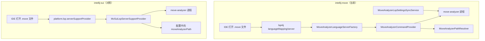
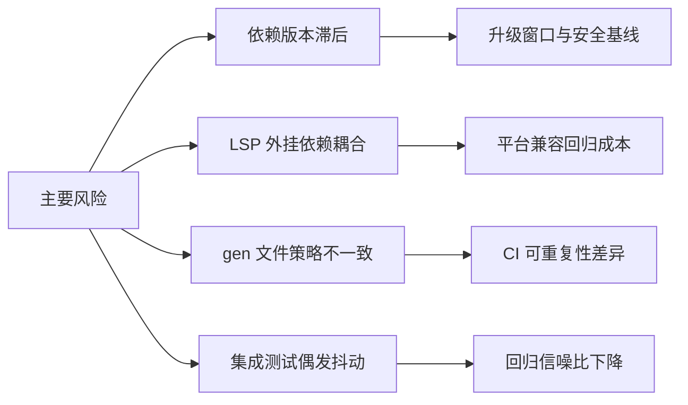

# IntelliJ Move vs IntelliJ Sui 架构差异报告（2026-03-02）

## 1. LSP 接入架构对比

## 2. 架构判定（图标矩阵）

| 对比维度 | 你的仓库 | 对照仓库 | 判定 |
|---|---|---|---|
| LSP provider 复杂度 | 分层（factory/command/resolver/sync） | 单一 provider | ✅ 你更可维护 |
| LSP 可观测性（来源日志、命令日志） | 完整 | 基础 | ✅ 你更强 |
| 配置变化热生效 | 有专门同步服务 | 触发重启 | ✅ 你更细粒度 |
| 平台依赖风险 | 依赖 `lsp4ij` 外挂 | 依赖 JetBrains 原生 API | ⚠️ 各有风险 |
| 接入门槛 | 逻辑更多 | 更轻量 | ⚠️ 你复杂度更高 |
| 测试闭环 | fake + integration + real analyzer | 无 `src/test` LSP 套件 | ✅ 你显著领先 |

## 3. 工程资产成熟度差异

| 资产类型 | 你的仓库 | 对照仓库 | 影响 |
|---|---|---|---|
| 迁移计划（`docs/plans`） | ✅ | ❌ | 团队可接力性更好 |
| 执行日志（`docs/logs/lsp`） | ✅ | ❌ | 问题追溯更快 |
| 回归清单（manual + automation） | ✅ | ❌ | 质量门槛更稳定 |
| UI 测试基础 | ✅ | ✅ | 两边都具备基础能力 |

## 4. 关键技术差异说明

### 4.1 LSP 依赖路线

- 你的仓库：`plugin.xml` 使用 `com.redhat.devtools.lsp4ij` 扩展点（`server + languageMapping`），并在构建中显式声明 `com.redhat.devtools.lsp4ij:0.19.2`。
- 对照仓库：`plugin.xml` 使用 `platform.lsp.serverSupportProvider`，依赖 JetBrains 平台内建能力。

技术含义：
- ✅ `lsp4ij` 方案给你更独立的封装能力，迁移期间便于控制行为。
- ⚠️ 额外插件依赖会引入兼容窗口与版本耦合，需要额外验证矩阵。
- ✅ 原生 `platform.lsp` 依赖更少，但在跨 IDE 版本行为差异上需要更紧跟平台节奏。

### 4.2 路径解析与命令构造

- 你的仓库已实现：
  - `CONFIGURED/PATH/CARGO_HOME/SUI_HOME/UNRESOLVED` 多源解析
  - `MoveAnalyzerCommandProvider` 工作目录策略
  - 兼容参数逻辑（legacy `--stdio`）
- 对照仓库主要依赖“配置路径是否有效”，策略较轻。

技术含义：
- ✅ 你对真实用户机器环境（PATH、home 下工具链）更友好。
- ✅ 排障时可观测性更强。
- ⚠️ 同时意味着逻辑复杂，必须依赖高质量测试托底（你目前已经在做）。

### 4.3 测试与质量基线

- 你的仓库：`src/test/kotlin/org/sui/ide/lsp` 下有完整套件，包含 fake server、integration、real analyzer opt-in。
- 对照仓库：无 `src/test` 主测试目录，更多依赖手工或 UI 场景。

技术含义：
- ✅ 你具备“可回归、可演进”的条件。
- ⚠️ 建议继续把偶发抖动（尤其 teardown）收敛为稳定基线。

## 5. 风险热力图

## 6. 对你当前工程的判断

- 总体判断：你的工程已经是“可持续演进状态”，并非“缺能力状态”。
- 真正需要改的是“维护成本控制”，不是“从零补功能”。
- 建议优先做“架构防耦合 + 依赖升级 + 生成物策略统一 + 测试稳定性”四件事。

