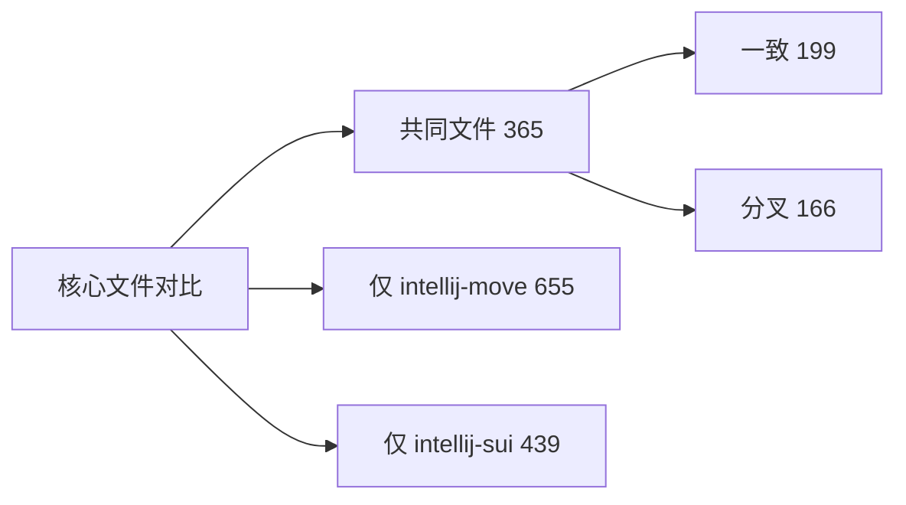

# IntelliJ Move vs IntelliJ Sui 对比总览（2026-03-02）

## 对比基线

- 本仓库：`intellij-move`，HEAD=`ef75459d`（2026-03-01）
- 对照仓库：`external/intellij-sui`，HEAD=`52a4eef`（2026-02-10）
- 对比时间：2026-03-02

## 结论先看

- ✅ 你的仓库在工程成熟度、测试覆盖、LSP 可观测性、文档治理上明显领先。
- ⚠️ 你的仓库仍有几项可优化点：依赖版本、`src/main/gen` 管理策略、LSP 抽象层统一、测试抖动收敛。
- 🟰 两边都基于同一 Move 语法体系（`MoveParser.bnf` + `MoveLexer.flex`），基础语言栈一致。

## 核心指标（图标对比）

| 维度 | `intellij-move` | `intellij-sui` | 对比判定 |
|---|---:|---:|---|
| 提交数 | 1478 | 1 | ✅ 你领先 |
| 贡献者数 | 11 | 1 | ✅ 你领先 |
| tracked 文件数 | 1137 | 832 | ✅ 你更完整 |
| `src/main/kotlin` 文件数 | 537 | 325 | ✅ 你覆盖更广 |
| `src/test/kotlin` 文件数 | 209 | 0 | ✅ 你测试体系明显更强 |
| Markdown 文档数 | 76 | 5 | ✅ 你治理更完善 |
| LSP 主实现文件数（`org/sui/ide/lsp`） | 5（含路径解析/命令/热同步） | 1（基础 provider） | ✅ 你更工程化 |
| LSP 测试文件数 | 7 | 0 | ✅ 你领先 |
| IDE 平台配置档案 | `gradle-223` 到 `gradle-261` | 仅 `gradle-253` | ✅ 你兼容面更广 |
| LSP 接入方式 | `lsp4ij` 外挂插件 | JetBrains `platform.lsp` | 🟰 各有取舍 |

## 代码同源程度（核心文件集合）

- 核心共同文件：365
- 其中完全一致：199
- 其中内容已分叉：166
- 仅你仓库存在（核心集合）：655
- 仅对照仓库存在（核心集合）：439（以 `src/main/gen` 追踪文件为主）

## 能力维度快照

| 能力项 | 你的仓库 | 对照仓库 | 备注 |
|---|---|---|---|
| Move 2024 开关（macro/type/public struct/let mut） | ✅ | ⚠️（较少） | 你的可配置能力更细 |
| LSP 路径解析来源标注（PATH/CARGO/SUI/CONFIG） | ✅ | ❌ | 你有完整解析与来源展示 |
| LSP 设置热同步（开关/路径变更触发重启） | ✅ | ⚠️（基础重启） | 你可观测性与控制更强 |
| 真实 analyzer 回归入口（opt-in） | ✅ | ❌ | 你有工程化回归策略 |
| 迁移计划/日志/回归 checklist | ✅ | ❌ | 你有完整过程资产 |

## 依赖与构建差异（需关注）

| 项目 | 你的仓库 | 对照仓库 | 建议 |
|---|---|---|---|
| Kotlin 插件 | 2.2.20 | 2.3.0 | ⚠️ 评估升级到 2.3.x |
| Sentry | 7.2.0 | 8.31.0 | ⚠️ 建议升级并回归 |
| Clikt | 3.5.2 | 5.0.3 | ⚠️ 建议升级 |
| commons-text | 1.10.0 | 1.15.0 | ⚠️ 建议升级 |
| LSP 依赖 | `com.redhat.devtools.lsp4ij:0.19.2` | 无（平台原生） | ⚠️ 评估抽象层解耦 |

## 你的仓库优先改进方向（总览）

1. P0：补一层统一 LSP Adapter，隔离 `lsp4ij` 与 `platform.lsp` 差异。
2. P1：升级关键依赖（Kotlin/Sentry/Clikt/commons-text）并跑全量回归。
3. P1：确定 `src/main/gen` 策略（全部追踪 or 全量忽略 + 强制生成校验）。
4. P2：继续收敛多项目 LSP 集成测试 teardown 抖动，降低偶发失败率。

