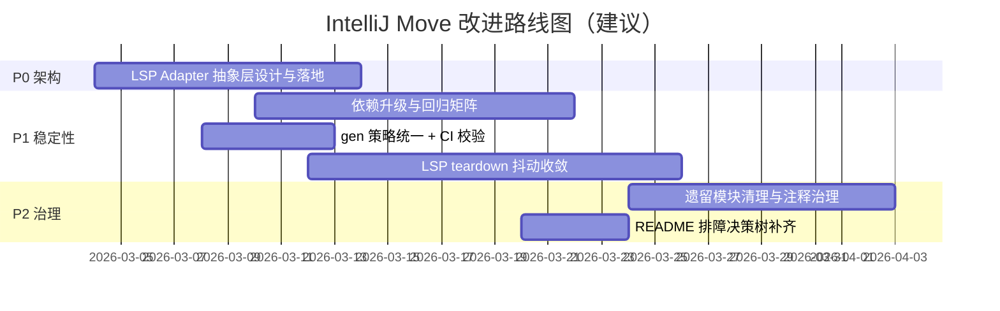

# IntelliJ Move 改进路线图（基于 IntelliJ Sui 对照，2026-03-02）

## 改进目标

- 目标不是“追平功能”，而是“降低维护成本 + 提升长期稳定性”。
- 你的项目当前能力已领先，路线图聚焦于工程质量和可持续演进。

## 优先级看板（图标版）

| 优先级 | 改进项 | 当前状态 | 价值 | 工作量 | 建议 |
|---|---|---|---|---|---|
| P0 | 统一 LSP Adapter（抽象 `lsp4ij/platform.lsp`） | ⚠️ 未抽象 | 高 | 中 | 先做 |
| P1 | 依赖升级（Kotlin/Sentry/Clikt/commons-text） | ⚠️ 部分落后 | 高 | 中 | 分批做 |
| P1 | 明确 `src/main/gen` 策略并固化 CI 校验 | ⚠️ 当前忽略 | 中 | 低 | 尽快定规 |
| P1 | 收敛 LSP 集成测试 teardown 抖动 | ⚠️ 有偶发 | 高 | 中 | 并行推进 |
| P2 | 精简遗留 Aptos 分支与过时注释 | ⚠️ 有历史包袱 | 中 | 中 | 稳步治理 |
| P2 | 对外 README 增补“LSP 排障决策树” | ❌ 缺失 | 中 | 低 | 文档补齐 |

## 路线图（Mermaid）

## 每项落地说明

### P0-1 统一 LSP Adapter

- 背景：当前 LSP 主链路绑定 `lsp4ij`，对照仓库走 `platform.lsp`。
- 动作：
  - 增加 `LspBackendAdapter` 接口层。
  - 把路径解析、命令构造、生命周期控制放在 adapter 外的共享层。
  - 以 feature flag 切换 backend。
- 验收：
  - 同一组 LSP integration 测试在两套 backend 至少一套全绿。
  - 关键场景（diagnostics/definition/hover/completion/references/rename）结果一致性可比较。

### P1-1 依赖升级分批执行

- 背景：`Kotlin/Sentry/Clikt/commons-text` 相比对照仓库版本偏旧。
- 动作：
  - 第一批：`commons-text`、`Clikt`。
  - 第二批：`Sentry`。
  - 第三批：`Kotlin`（最后升，避免牵引过多编译行为变化）。
- 验收：
  - `./gradlew compileKotlin`
  - `./gradlew test`
  - `./gradlew verifyPlugin`
  - 关键 LSP 套件定向回归

### P1-2 `src/main/gen` 策略统一

- 背景：你仓库忽略 `src/main/gen`，对照仓库追踪生成物。
- 动作（两选一，二选一后固定）：
  - 方案 A：继续忽略，但在 CI 增加“生成后无差异校验”。
  - 方案 B：追踪生成物，减少本地/CI 生成差异。
- 验收：
  - PR 中 parser/lexer 变更对审查者可见。
  - CI 不再出现“本地可过、CI 不一致”的生成物问题。

### P1-3 LSP 抖动收敛

- 背景：多项目 workspace 场景已有偶发 teardown 抖动记录。
- 动作：
  - 提升 test fixture 生命周期隔离。
  - 对 wrapper 销毁流程做超时/重试与状态埋点。
  - 给 flaky 场景增加定向 stress 回归任务。
- 验收：
  - 连续 20 次定向执行无偶发失败。
  - 标记为 flaky 的用例数量持续下降。

### P2-1 遗留能力清理

- 背景：仓库中仍有历史 Aptos 分支和较多注释保留逻辑。
- 动作：
  - 标注“保留原因”，无原因项进入清理清单。
  - 删除未使用路径与死代码，减轻认知负担。
- 验收：
  - 代码搜索噪音下降。
  - 新成员定位核心链路时间降低。

## 你可以直接执行的下一步

1. 先开一个 `LSP Adapter` 设计草案（接口 + 两端实现的最小骨架）。
2. 同时开一个“依赖升级试验分支”，先跑最小升级批次（Clikt/commons-text）。
3. 在 CI 增加 `generateLexer/generateParser` 一致性检查任务，锁定 `src/main/gen` 策略。

